# Architecture

## Overview (Simple)

```
User → Frontend (Next.js) → API (FastAPI) → Celery Workers → Pipeline Modules
                        ↕                        ↕
                   WebSocket ← Redis Pub/Sub ← State Store
```

Four services run via Docker Compose:
- **Redis** — job state, Celery broker, event bus
- **FastAPI** — REST endpoints + WebSocket broadcasting
- **Celery Worker** — async processing (classify, process, group, generate)
- **Frontend** — React UI with real-time updates

---

## Component Diagram

```mermaid
graph TB
    subgraph Frontend [Next.js 16 Frontend]
        UI[React UI]
        WS[useWebSocket Hook]
        API[API Client utils/api.js]
    end

    subgraph Backend [FastAPI Server]
        REST[REST Endpoints]
        WSE[WebSocket Endpoint]
        RM[Redis Pub/Sub Listener]
        CM[ConnectionManager]
    end

    subgraph Workers [Celery Workers]
        T1[process_image Task]
        T2[run_grouping Task]
        T3[generate_catalog Task]
    end

    subgraph Pipeline [Pipeline Modules]
        CL[classifier.py]
        IP[image_processor.py]
        OCR[ocr.py]
        GR[grouper.py]
        PPT[ppt_generator.py]
    end

    subgraph Storage [Redis]
        KV[Hash: jobs]
        SG[Key: style_groups]
        PS[Pub/Sub: ws_events]
        CB[Celery Broker]
    end

    subgraph AI [AI Providers]
        GM[Gemini 2.5 Flash]
        OR[OpenRouter Fallback]
    end

    subgraph Files [File System]
        ID[input/images/]
        OP[output/processed_images/]
        PG[output/Processed_Garments/]
        PPTX[output/Catalog.pptx]
    end

    UI -->|upload| API
    API -->|HTTP| REST
    UI -->|WebSocket| WSE
    WS -->|connect| WSE

    REST -->|publish event| PS
    REST -->|store state| KV
    REST -->|enqueue| CB

    WSE -->|subscribe| PS
    WSE -->|broadcast| CM
    CM -->|send_json| WS

    T1 -->|poll| CB
    T1 -->|read/write| KV
    T1 -->|process| IP
    T1 -->|classify| CL
    T1 -->|extract| OCR
    T1 -->|publish event| PS

    T2 -->|poll| CB
    T2 -->|read/write| KV
    T2 -->|read/write| SG
    T2 -->|group| GR
    T2 -->|publish event| PS

    T3 -->|poll| CB
    T3 -->|read| KV
    T3 -->|read| SG
    T3 -->|generate| PPT
    T3 -->|write| PPTX
    T3 -->|organize| PG
    T3 -->|publish event| PS

    CL -->|HTTP| GM
    CL -->|HTTP| OR
    OCR -->|HTTP| GM
    OCR -->|HTTP| OR
    GR -->|HTTP| GM
    GR -->|HTTP| OR

    REST -->|read/write| ID
    REST -->|read| OP
    T1 -->|write| OP
    T3 -->|copy| PG
```



---

## Frontend

| Component | File | Role |
|-----------|------|------|
| Page | `page.tsx` | Root component managing application state (jobs, groups), WebSocket message handling, workspace partitioning, undo/redo history. |
| Canvas | `Canvas.jsx` | Main workspace area with three view modes — Groups, All Images, Ungrouped. Contains action buttons (Scan, Group, Generate, Download, Reset). |
| StyleGroup | `StyleGroup.jsx` | Container for one garment style. Displays group metadata, spec data summary, and image cards. Acts as a drop target for drag-and-drop reassignment. |
| ImageCard | `ImageCard.jsx` | Single image thumbnail with type badge, confidence score, status badge, classification metadata, and expandable spec data (for SPEC_LABEL type). Implements custom drag ghost. |
| UploadZone | `UploadZone.jsx` | Drag-drop and file picker upload with per-batch (5 files) progress display. |
| PipelinePanel | `PipelinePanel.jsx` | Left sidebar showing pipeline stage counts, progress bar, style group count. |
| FloatingToolbar | `FloatingToolbar.jsx` | Vertical toolbar with buttons to toggle upload panel and stats panel. |
| useWebSocket | `hooks/useWebSocket.js` | Auto-connecting WebSocket with 3-second reconnect and 30-second ping keepalive. |
| API Client | `utils/api.js` | Functions for all REST endpoints with dynamic base URL resolution. |

---

## Backend

| Layer | File | Purpose |
|-------|------|---------|
| REST API | `main.py` | Defines 14 REST endpoints and 1 WebSocket endpoint. Manages Redis connections (sync for endpoints, async for pub/sub listener). The ConnectionManager class tracks active WebSocket clients. A background `redis_listener` coroutine subscribes to `ws_events` channel and broadcasts to all connected clients. |
| Models | `models/schemas.py` | Pydantic models — `ImageType` enum (FRONT/BACK/DETAIL/SPEC_LABEL/UNKNOWN), `JobStatus` enum, `ClassificationResult`, `SpecData`, `ImageJob`, `StyleGroup`, `WebSocketMessage`, `PipelineStats`. |

### Pipeline Modules

| Module | File | Role |
|--------|------|------|
| Classifier | `pipeline/classifier.py` | Sends image to Gemini API with a detailed classification prompt. Retries up to 3 times. Resizes images to max 1024px for API efficiency. Parses JSON response into `ClassificationResult`. |
| Image Processor | `pipeline/image_processor.py` | 5-step processing pipeline: (1) background removal via rembg (disabled by default), (2) auto-rotation of landscape garment images, (3) smart cropping via OpenCV contour detection, (4) brightness/contrast histogram correction, (5) max-dimension resize to 1000px. |
| OCR | `pipeline/ocr.py` | Sends spec label images to AI with extraction prompt. Higher resolution (1536px max). Returns `SpecData` with ref_number, fabric_composition, gsm, date, remarks. |
| Grouper | `pipeline/grouper.py` | 4-pass grouping algorithm: Pass 1 (Timestamp Gap), Pass 1.5 (Split Overloaded), Pass 2 (Heuristic Fuzzy), Pass 3 (AI Vision Solos), Pass 4 (AI Vision Suspicious). |
| PPT Generator | `pipeline/ppt_generator.py` | Creates PowerPoint using python-pptx. Loads reference PPT for dimensions if available. Generates a cover slide and per-style slides with dark header, cream body, front/back/detail images in framed positions, spec data panel, and footer. |
| AI Client | `utils/ai_client.py` | Unified AI vision client supporting Gemini (primary) and OpenRouter (fallback). Handles provider selection, retry logic, and response parsing. |
| File Utils | `utils/file_utils.py` | File path and I/O helpers: directory management, base64 encoding, file saving, output organization into `Processed_Garments/`. |

---

## Queue / Worker Architecture

Celery with Redis broker:

| Task | Trigger | What It Does |
|------|---------|-------------|
| `process_image` | Upload / Scan | Per-image task. Runs classification, image processing, and (for spec labels) OCR. Auto-triggers grouping when all images complete. |
| `run_grouping` | Manual / Auto | Single task. Groups all processed images into style groups using the 4-pass algorithm. |
| `generate_catalog` | Manual | Single task. Generates the PowerPoint catalog from style groups. |

---

## Data Flow

1. **Ingestion:** Images uploaded via `POST /upload` or scanned via `POST /scan` → saved to `input/images/` → job created in Redis → Celery task enqueued → event published via Redis pub/sub → FastAPI listener broadcasts to WebSocket clients.

2. **Processing:** Worker runs classification → stores `image_type` in job → runs image processing → saves processed image to `output/processed_images/` → runs OCR for spec labels → updates job status → publishes event.

3. **Grouping:** When all jobs reach "cleaned" or "failed", grouping auto-triggers (or manual via `POST /group`) → runs 4-pass algorithm → stores style groups in Redis → assigns `style_group` to each job → publishes event.

4. **Generation:** Manual trigger via `POST /generate` → loads jobs and groups → generates PPTX → saves to `output/Catalog.pptx` → copies organized files to `output/Processed_Garments/` → updates all jobs to "ppt_ready".

5. **Download:** `GET /download` serves `output/Catalog.pptx`.

---

## Event Flow

All state changes emit JSON events via Redis pub/sub channel `ws_events`:

| Event | When |
|-------|------|
| `initial_state` | Client connects — full snapshot of all jobs + groups |
| `job_update` | Any job state change (per-image stages) |
| `grouping_started` | Grouping begins |
| `grouping_complete` | Grouping finishes with group data |
| `grouping_failed` | Grouping errors |
| `catalog_started` | PPT generation begins |
| `catalog_complete` | PPT generation finishes with output path |
| `catalog_failed` | PPT generation errors |
| `image_moved` | Manual drag-drop reassignment |
| `groups_update` | Group metadata change (e.g., after classification override) |
| `job_deleted` | Single job removal |
| `pipeline_reset` | Full pipeline reset |
| `solo_resolved` | Pass 3 grouping resolution |

---

## Storage Architecture

- **Redis** is the primary state store:
  - Hash `jobs`: Keyed by job UUID, stores full job JSON
  - Key `style_groups`: JSON-encoded dict of style groups
  - Pub/sub `ws_events`: Event bus between workers and API server
  - Celery broker and result backend

- **File System** stores images:
  - `input/images/`: Raw uploaded/scanned images
  - `output/processed_images/`: Processed (cropped, color-corrected) images
  - `output/Processed_Garments/`: Organized output with `StyleName_front.jpg` naming
  - `output/Catalog.pptx`: Final generated catalog
