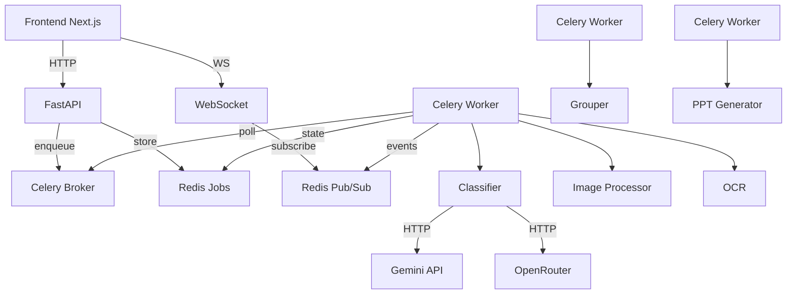

# Architecture

## Overview (Simple)

```
User → Frontend (Next.js) → API (FastAPI) → Celery Workers → Pipeline Modules
                        ↕                        ↕
                   WebSocket ← Redis Pub/Sub ← State Store
```

Four services run via Docker Compose:
- **Redis** — job state, Celery broker, event bus
- **FastAPI** — REST endpoints + WebSocket broadcasting
- **Celery Worker** — async processing (classify, process, group, generate)
- **Frontend** — React UI with real-time updates

---

## Component Diagram



---

## Component Breakdown (Detailed)

### Frontend

| Component | File | Role |
|-----------|------|------|
| Page | `page.tsx` | State management (jobs, groups), WS message routing, undo/redo |
| Canvas | `Canvas.jsx` | Workspace with Groups/All/Ungrouped views, action buttons |
| StyleGroup | `StyleGroup.jsx` | Style card, drop target for drag-and-drop |
| ImageCard | `ImageCard.jsx` | Thumbnail + type badge + confidence + status |
| UploadZone | `UploadZone.jsx` | Drag-drop upload, 5-file batches, progress |
| PipelinePanel | `PipelinePanel.jsx` | Stage counts, progress bar |
| FloatingToolbar | `FloatingToolbar.jsx` | Side buttons for upload/stats toggle |
| useWebSocket | `hooks/useWebSocket.js` | Auto-connect, 3s reconnect, 30s ping |
| api.js | `utils/api.js` | All REST endpoint functions |

### Backend

| Layer | File | Purpose |
|-------|------|---------|
| REST API | `main.py` | 14 endpoints + 1 WebSocket |
| Models | `models/schemas.py` | ImageType, JobStatus, ImageJob, StyleGroup, etc. |
| Classifier | `pipeline/classifier.py` | AI image → type (FRONT/BACK/DETAIL/SPEC_LABEL) |
| Image Processor | `pipeline/image_processor.py` | Crop, rotate, color-correct, resize |
| OCR | `pipeline/ocr.py` | Spec label → ref, fabric, GSM, date |
| Grouper | `pipeline/grouper.py` | 4-pass grouping algorithm |
| PPT Generator | `pipeline/ppt_generator.py` | python-pptx catalog builder |
| AI Client | `utils/ai_client.py` | Gemini primary + OpenRouter fallback |

### Queue (Celery)

| Task | Trigger | What It Does |
|------|---------|-------------|
| `process_image` | Upload / Scan | classify → process → OCR → auto-group if done |
| `run_grouping` | Manual / Auto | 4-pass grouping (timestamp → fuzzy → vision) |
| `generate_catalog` | Manual | Build PPTX + organize output files |

---

## Data Flow

```
Upload → Save file → Redis job → Celery task → Classify → Process → OCR
                                                                    ↓
                                                            Group (auto if all done)
                                                                    ↓
                                                            Generate PPT → Download
```

## Event Flow

All events flow: **Worker → Redis Pub/Sub → FastAPI Listener → WebSocket Clients**

| Event | When |
|-------|------|
| `initial_state` | Client connects |
| `job_update` | Any job status change |
| `grouping_started/completed/failed` | Grouping lifecycle |
| `catalog_started/completed/failed` | Catalog generation lifecycle |
| `image_moved` | Drag-drop reassignment |
| `job_deleted` | Job removed |
| `pipeline_reset` | All data cleared |

## Storage

- **Redis:** Jobs (hash), style groups (string), event bus (pub/sub), Celery broker
- **File System:** `input/images/`, `output/processed_images/`, `output/Catalog.pptx`, `output/Processed_Garments/`
