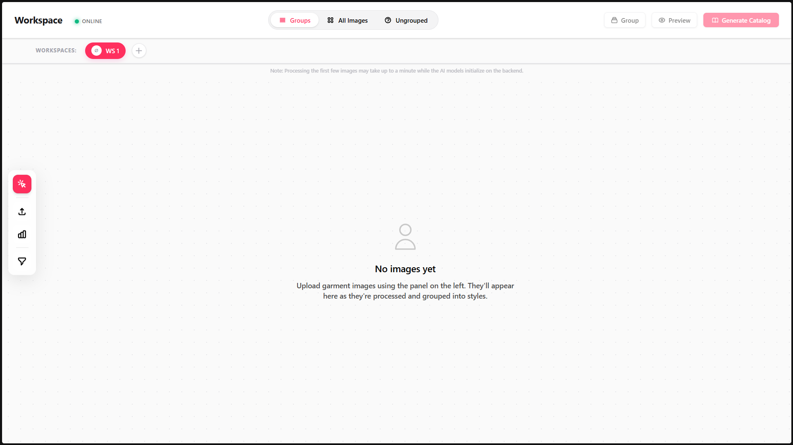
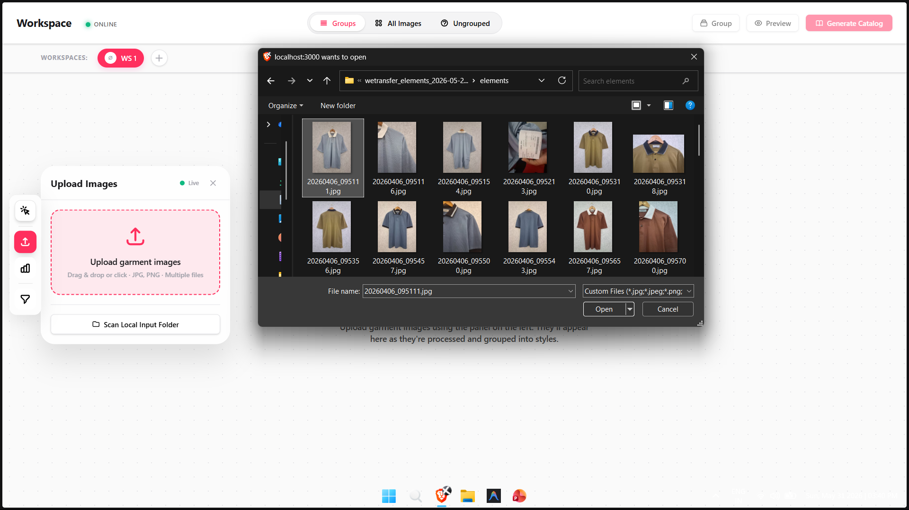
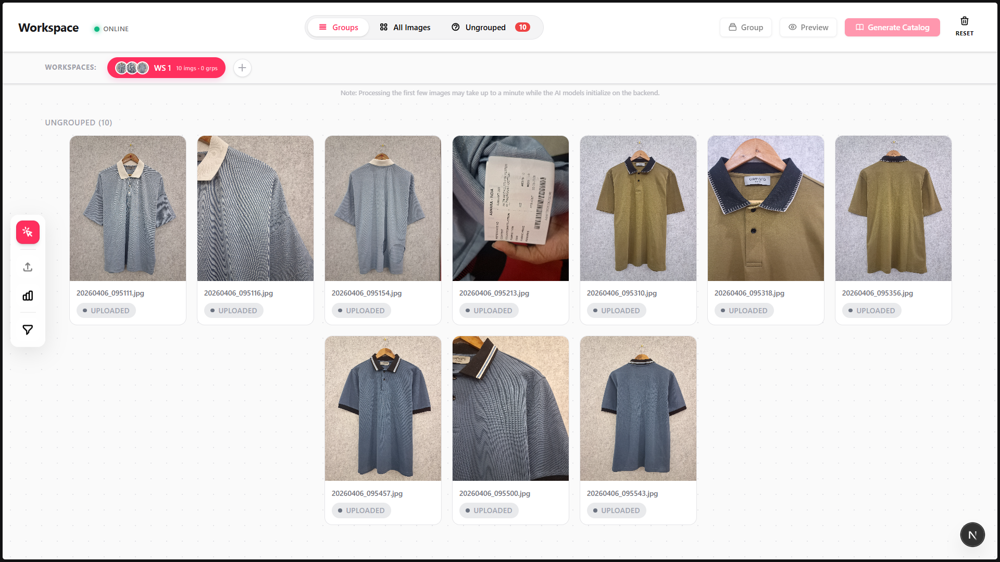
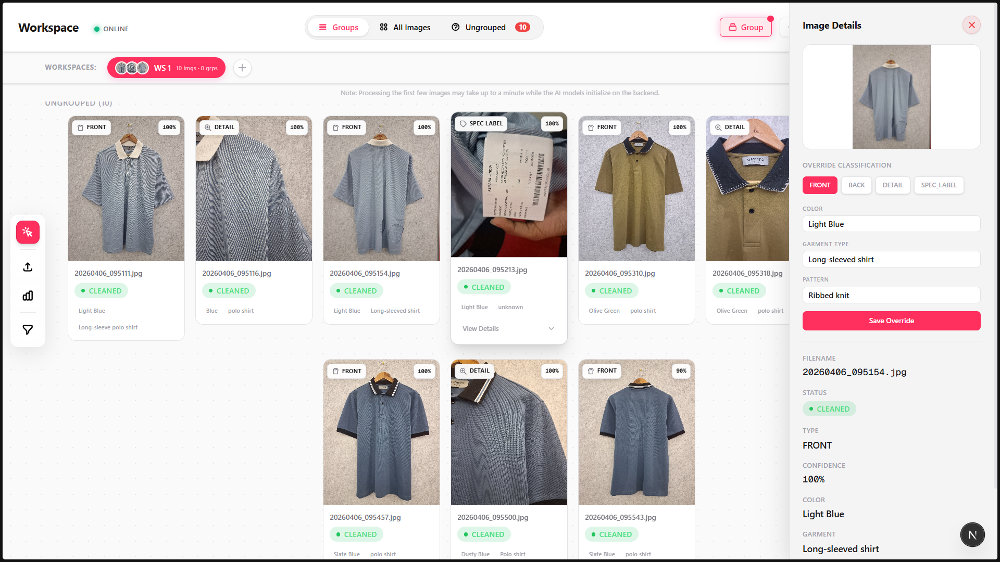
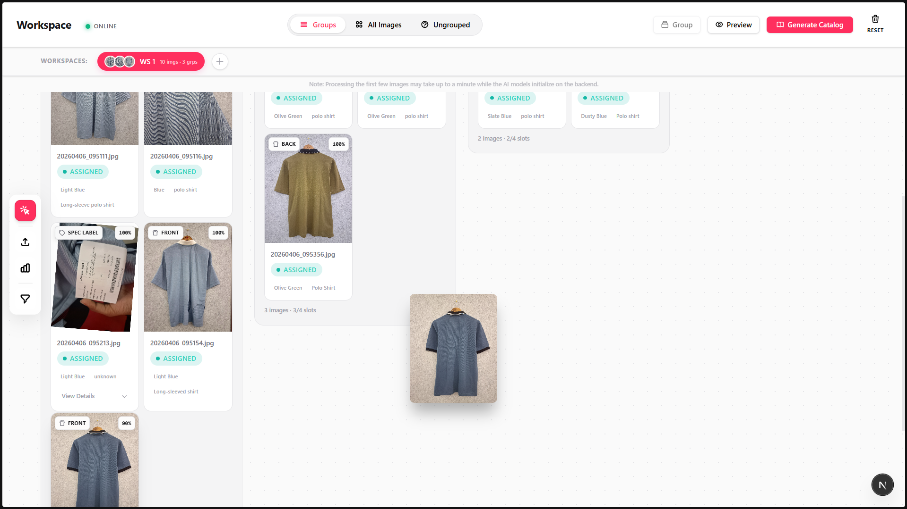
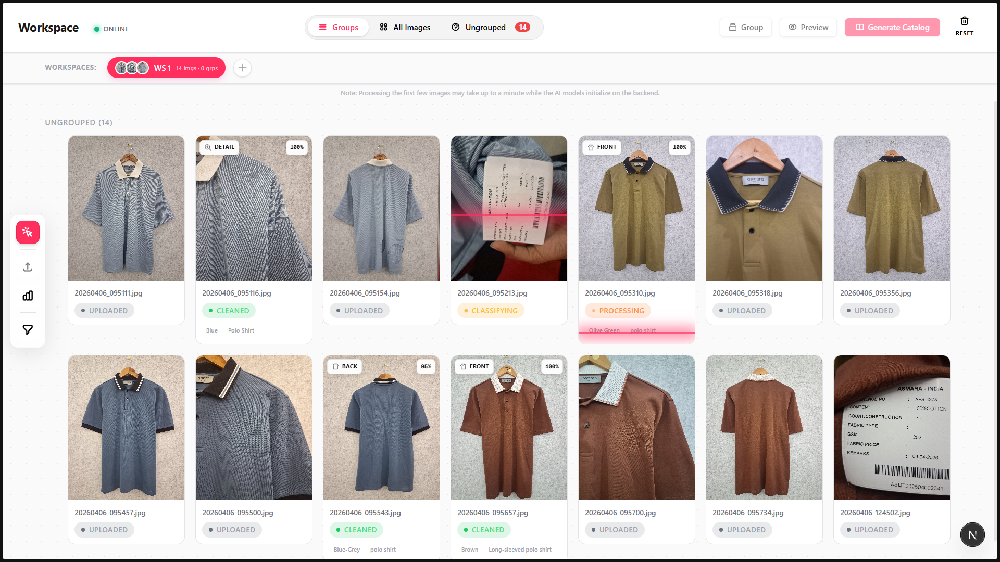
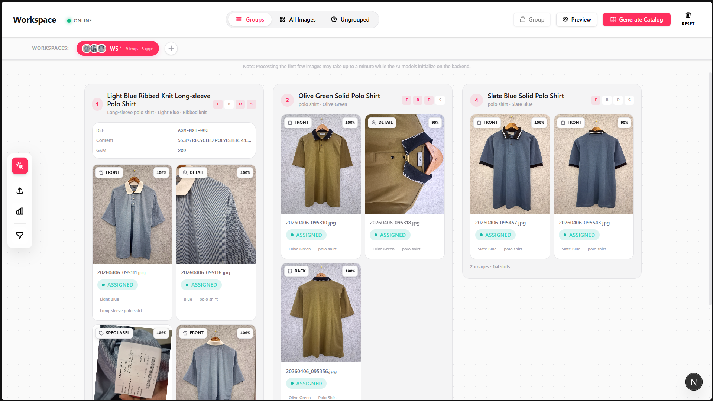
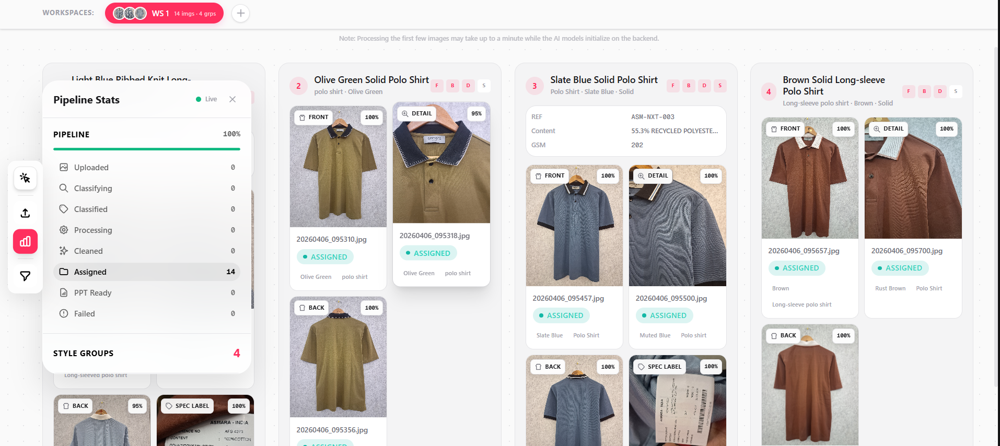
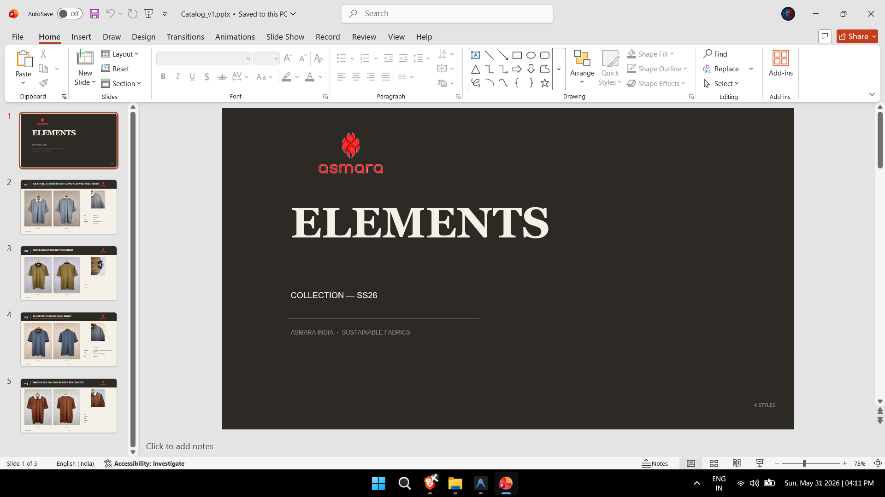
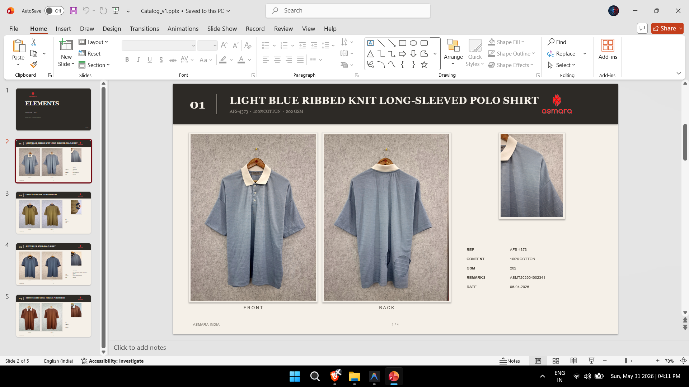

# Visual Walkthrough

### Empty View

### Upload Zone

### Visual Workspace

### Detail Override Panel

### Drag and Drop

### Pipeline Processing

### Groups & Styles

### Pipeline Live Stats

### PPT Cover

### PPT Style Slide

### Interactive Walkthrough

A step-by-step walkthrough of the application is available below:

👉 **Dubble Guide**  
https://dubble.so/guides/guide-with-localhost-hsaacdica7rnm0yhseba
